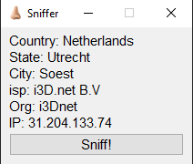

# omegle-sniffer

An IP locator for Omegle.

FOR EDUCATIONAL PURPOSES ONLY!

I AM NOT RESPONSIBLE FOR ANY MISUSE OR ABUSE.

I wanted a project to filter internet traffic, use an API, and build an application window.

## Installation
1. Install tshark with [wireshark](https://www.wireshark.org/download.html)
2. Clone the repository
3. Install the required packages
4. Run sniff.py

## Usage
Press the button to automatically locate the IP.

## Caveats
It may not work for some people. It could be that the filter is blocking their IP prefix. Also, other traffic may interfere with the results, so if the Org is Google LLC or Valve Corp., make sure to block that IP prefix.

## How it works
Using a [pyshark](https://pypi.org/project/pyshark/), a python wrapper for tshark, this program captures traffic for 1 second and locates the most common IP address that appears. This can lead to incorrect IPs being selected to be searched. The block list allows for the user to block IP addresses which start with any number. [PyQt6](https://pypi.org/project/PyQt6/) was used to make the application window.
